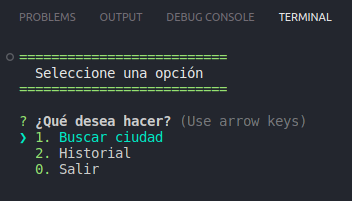
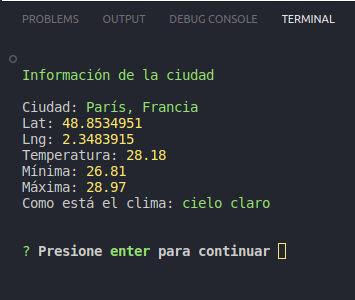
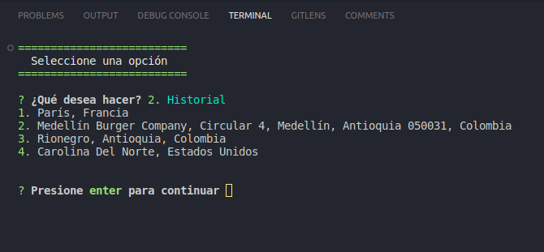

# Aplicación Backend de Clima

Aplicación de terminal desarrollada en Node.js v18.16.0 para buscar el clíma de una ciudad en tiempo real.

#### Menú Principal

#### Datos Ciudad Seleccionada

Datos del clima de la ciudad seleccionada

#### Historial de búsqueda

## Variables de entorno

| Variable        |                         Onservación                          |
| --------------- | :----------------------------------------------------------: |
| MAPBOX_KEY      |   Agregar el valor de la key desde https://www.mapbox.com/   |
| OPENWEATHER_KEY | Agregar el valor de la key desde https://openweathermap.org/ |

- Reconstruir los módulos de node con el comando `npm init`
